# Vue to Spring Boot Connection Flow Diagram

## Architecture Overview

This document describes how the Vue.js frontend connects to the Spring Boot backend through Vite's development proxy, including CORS handling.

## High-Level Architecture Diagram


## Main Connection Flow Diagram

This diagram shows the complete request/response flow from Vue component to Spring Boot backend:


## Simplified Request Flow (Step-by-Step)


## Detailed Component Breakdown

### Frontend Layer (Vue.js)


### Proxy Layer (Vite Dev Server)


### Backend Layer (Spring Boot)

```mermaid
graph TD
    A[HTTP Request] -->|1| B[CORS Filter<br/>CorsConfig.java]
    B -->|2. Validate Origin| C{Origin<br/>localhost:5173?}
    C -->|Yes| D[Allow + Add CORS Headers]
    C -->|No| E[❌ Block Request]
    D -->|3| F[Security Filter<br/>SecurityConfig.java]
    F -->|4. Check CSRF| G{CSRF<br/>Enabled?}
    G -->|No for /api/**| H[Pass Through]
    G -->|Yes| I[❌ Block Request]
    H -->|5| J[Controller<br/>@RestController]
    J -->|6| K[Service Layer]
    K -->|7| L[Generate Response]
    L -->|8| M[Add CORS Headers]
    M --> N[Return Response]
    
    style B fill:#ffa726,color:#000
    style F fill:#ffa726,color:#000
    style J fill:#6db33f,color:#fff
    style E fill:#ef5350,color:#fff
    style I fill:#ef5350,color:#fff
```

## Detailed Flow Description

### Step-by-Step Flow

#### 1. Frontend Request Initiation
- **Component**: Vue component (e.g., `LoginView.vue`) triggers user action
- **Store**: Pinia store (`stores/auth.ts`) calls the API service
- **Service**: API service (`services/api.ts`) uses Axios with `baseURL: '/api'`

#### 2. Request Interception
- Axios request interceptor checks `localStorage` for JWT token
- If token exists, adds `Authorization: Bearer <token>` header
- Sets `Content-Type: application/json`

#### 3. Vite Proxy Configuration
```typescript
// vite.config.ts
proxy: {
  '/api': {
    target: 'http://localhost:8080',
    changeOrigin: true,
    secure: false,
    rewrite: (path) => path, // Keeps /api prefix
  }
}
```
- **Match**: All requests starting with `/api`
- **Target**: Forwards to `http://localhost:8080`
- **Change Origin**: Sets `Host` header to target server
- **Keep Path**: Maintains `/api` prefix in forwarded request

#### 4. Browser CORS Handling
- Browser may send **OPTIONS preflight** request for cross-origin requests
- Preflight checks if server allows the actual request
- Server responds with CORS headers:
  - `Access-Control-Allow-Origin: http://localhost:5173`
  - `Access-Control-Allow-Methods: GET, POST, PUT, DELETE, OPTIONS`
  - `Access-Control-Allow-Headers: *`
  - `Access-Control-Allow-Credentials: true`

#### 5. Spring Boot CORS Configuration
```java
@Configuration
public class CorsConfig {
    @Bean
    public CorsConfigurationSource corsConfigurationSource() {
        CorsConfiguration configuration = new CorsConfiguration();
        configuration.setAllowedOrigins(Arrays.asList("http://localhost:5173"));
        configuration.setAllowedMethods(Arrays.asList("GET", "POST", "PUT", "DELETE", "OPTIONS"));
        configuration.setAllowedHeaders(Arrays.asList("*"));
        configuration.setAllowCredentials(true);
        
        UrlBasedCorsConfigurationSource source = new UrlBasedCorsConfigurationSource();
        source.registerCorsConfiguration("/api/**", configuration);
        return source;
    }
}
```

#### 6. Spring Security Filter Chain
```java
@Configuration
@EnableWebSecurity
public class SecurityConfig {
    @Bean
    public SecurityFilterChain filterChain(HttpSecurity http) throws Exception {
        http
            .csrf(csrf -> csrf
                .ignoringRequestMatchers("/api/**") // Disable CSRF for API
            )
            .cors(cors -> cors.configurationSource(corsConfigurationSource()))
            .authorizeHttpRequests(auth -> auth
                .requestMatchers("/api/auth/login").permitAll()
                .requestMatchers("/api/**").authenticated()
            );
        return http.build();
    }
}
```

#### 7. Request Processing
- Controller receives request at `/api/auth/login`
- Authentication service validates credentials
- On success: Generates JWT token
- On failure: Returns 401 Unauthorized

#### 8. Response Path
- Controller returns JSON response with JWT token
- CORS filter adds CORS headers to response
- Response flows back through proxy to frontend
- Axios response interceptor:
  - Checks for 401 status (removes token if found)
  - Returns response data
- Store saves token to `localStorage`
- Component updates UI with response

## Key Configuration Files

### Frontend
- **`vite.config.ts`**: Proxy configuration
- **`src/services/api.ts`**: Axios client with interceptors
- **`src/stores/auth.ts`**: State management for authentication

### Backend (Spring Boot)
- **`CorsConfig.java`**: CORS configuration
- **`SecurityConfig.java`**: Spring Security configuration
- **`*Controller.java`**: REST controllers handling `/api/**` endpoints

## Request/Response Headers Flow

### Request Headers (Frontend → Backend)
```
POST /api/auth/login HTTP/1.1
Host: localhost:8080
Origin: http://localhost:5173
Content-Type: application/json
Authorization: Bearer <token> (if authenticated)
```

### Response Headers (Backend → Frontend)
```
HTTP/1.1 200 OK
Access-Control-Allow-Origin: http://localhost:5173
Access-Control-Allow-Credentials: true
Access-Control-Allow-Methods: GET, POST, PUT, DELETE, OPTIONS
Content-Type: application/json
```

## CORS Flow Diagram

This diagram shows how CORS (Cross-Origin Resource Sharing) is handled:

```mermaid
sequenceDiagram
    autonumber
    participant Browser as Browser<br/>(localhost:5173)
    participant Proxy as Vite Proxy<br/>(localhost:5173)
    participant CORS as CORS Filter<br/>(Spring Boot)
    participant Backend as Backend Service<br/>(Spring Boot)

    Note over Browser,Backend: Step 1: Preflight Request (if needed)
    Browser->>Proxy: OPTIONS /api/auth/login<br/>Origin: http://localhost:5173<br/>Access-Control-Request-Method: POST
    Proxy->>CORS: Forward OPTIONS Request
    CORS->>CORS: Check Origin<br/>Is localhost:5173 allowed?
    alt Origin Allowed
        CORS->>Proxy: 200 OK<br/>Access-Control-Allow-Origin: http://localhost:5173<br/>Access-Control-Allow-Methods: POST<br/>Access-Control-Allow-Credentials: true
        Proxy->>Browser: Forward CORS Headers
        Note over Browser: Browser now knows request is allowed
    else Origin Blocked
        CORS->>Proxy: 403 Forbidden
        Proxy->>Browser: CORS Error
    end
    
    Note over Browser,Backend: Step 2: Actual Request
    Browser->>Proxy: POST /api/auth/login<br/>Origin: http://localhost:5173<br/>Content-Type: application/json<br/>Body: {username, password}
    Proxy->>CORS: Forward POST Request<br/>(with Origin header)
    CORS->>CORS: Validate Origin Again<br/>localhost:5173 ✓
    CORS->>Backend: Forward Request<br/>(Origin header preserved)
    Backend->>Backend: Process Request<br/>Validate Credentials<br/>Generate JWT
    Backend->>CORS: JSON Response<br/>{token, user}
    CORS->>CORS: Add CORS Headers to Response<br/>Access-Control-Allow-Origin<br/>Access-Control-Allow-Credentials
    CORS->>Proxy: Response + CORS Headers
    Proxy->>Browser: Forward Response<br/>with CORS Headers
    Browser->>Browser: Browser validates CORS headers<br/>Allows response if origin matches
```



## CORS Configuration Visual Guide


## Token Refresh Flow

This diagram shows how automatic token refresh works when access tokens expire or are about to expire:


## Token Blacklisting Flow

This diagram shows how token blacklisting works during logout and subsequent request validation:


## Token Refresh and Blacklisting Architecture

```mermaid
flowchart TB
    subgraph Frontend["🌐 Frontend - Token Management"]
        A[Axios Request Interceptor] -->|Check Expiry| B{Token Expired?<br/>expiresAt - 1min}
        B -->|Yes| C[Call Refresh Endpoint]
        B -->|No| D[Use Current Token]
        C -->|Success| E[Store New Tokens<br/>localStorage]
        C -->|Failure| F[Clear Tokens<br/>Dispatch Logout Event]
        E --> D
        F --> G[Redirect to Login]
    end

    subgraph Backend["☕ Backend - Token Services"]
        H[/api/auth/refresh<br/>POST] --> I[RefreshTokenService<br/>Validate Refresh Token]
        I -->|Valid| J[Generate New Access Token<br/>+ Optional New Refresh Token]
        I -->|Invalid| K[❌ 401 Unauthorized]
        J --> L[Return LoginResponse]
        
        M[/api/auth/logout<br/>POST] --> N[TokenBlacklistService<br/>Blacklist Access Token]
        M --> O[RefreshTokenService<br/>Revoke Refresh Token]
        N --> P[Store in Blacklist Map]
        O --> Q[Remove from Storage]
    end

    subgraph Validation["🔒 Token Validation"]
        R[API Request] --> S[JwtTokenProvider<br/>validateToken]
        S --> T{Check Blacklist<br/>TokenBlacklistService}
        T -->|Blacklisted| U[❌ 401 Unauthorized]
        T -->|Not Blacklisted| V{Check Expiry<br/>JWT Claims}
        V -->|Expired| U
        V -->|Valid| W[✅ Allow Request]
    end

    D --> R
    L --> E
    U --> X[Frontend: Try Refresh]
    X --> C
    
    style A fill:#42b983,color:#fff
    style H fill:#6db33f,color:#fff
    style M fill:#6db33f,color:#fff
    style I fill:#ffa726,color:#000
    style N fill:#ffa726,color:#000
    style T fill:#ffa726,color:#000
    style F fill:#ef5350,color:#fff
    style K fill:#ef5350,color:#fff
    style U fill:#ef5350,color:#fff
```

## Error Handling

### Common Errors and Solutions

1. **403 Forbidden**
   - Cause: CSRF protection or CORS not configured
   - Solution: Disable CSRF for `/api/**` and configure CORS

2. **CORS Error**
   - Cause: Origin `http://localhost:5173` not allowed
   - Solution: Add origin to `allowedOrigins` in `CorsConfig`

3. **401 Unauthorized**
   - Cause: Invalid credentials, expired token, or blacklisted token
   - Solution: Frontend automatically attempts token refresh. If refresh fails, user is logged out and redirected to login page

4. **Network Error**
   - Cause: Backend not running or proxy misconfiguration
   - Solution: Check backend on port 8080 and proxy config

## E2E Testing Architecture

This diagram shows how E2E tests are integrated into the development and CI/CD workflow:


## E2E Test Execution Flow

This diagram shows the detailed flow of E2E test execution:

```mermaid
sequenceDiagram
    autonumber
    participant Dev as Developer/CI
    participant Script as Test Script<br/>run-all-tests.sh
    participant Vitest as Vitest<br/>Unit Tests
    participant Vite as Vite Dev Server
    participant Cypress as Cypress<br/>E2E Tests
    participant Browser as Test Browser<br/>(Headless/UI)
    participant Backend as Backend API<br/>(Optional)

    Dev->>Script: npm run test:all
    Script->>Vitest: Run unit/component tests
    Vitest->>Vitest: Execute test suites
    Vitest-->>Script: ✓ Unit tests passed
    
    Script->>Vite: Start dev server (npm run dev &)
    Vite->>Vite: Initialize on port 5173
    Vite-->>Script: Server ready
    
    Script->>Cypress: Run E2E tests (cy:run)
    Cypress->>Browser: Launch test browser
    Browser->>Vite: Navigate to localhost:5173
    Vite->>Browser: Serve Vue application
    
    loop E2E Test Suite
        Browser->>Browser: Execute test steps
        Browser->>Vite: API requests (/api/**)
        Vite->>Backend: Proxy to localhost:8080
        Backend-->>Vite: API responses
        Vite-->>Browser: Forward responses
        Browser->>Browser: Assertions & validations
    end
    
    Browser-->>Cypress: Test results
    Cypress-->>Script: ✓ E2E tests passed
    
    Script->>Vite: Stop dev server (pkill)
    Vite-->>Script: Server stopped
    
    Script-->>Dev: All tests completed ✓
```



## Test Coverage Architecture

This diagram shows how different test types cover the application:

```mermaid
graph TB
    subgraph App["📱 Application Layers"]
        A[Vue Components<br/>Views, UI]
        B[Pinia Stores<br/>State Management]
        C[API Services<br/>Axios, Interceptors]
        D[Router<br/>Navigation Guards]
    end
    
    subgraph UnitTests["🔬 Unit Tests (Vitest)"]
        E[Component Tests<br/>LoginView.spec.ts]
        F[Store Tests<br/>auth.store.spec.ts]
        G[Service Tests<br/>api.spec.ts]
    end
    
    subgraph E2ETests["🌐 E2E Tests (Cypress)"]
        H[Authentication Flow<br/>auth.cy.ts]
        I[Token Management<br/>token-refresh.cy.ts<br/>token-blacklist.cy.ts]
        J[Route Protection<br/>routes.cy.ts]
        K[User Flows<br/>logout.cy.ts<br/>clock-skew.cy.ts]
    end
    
    A -->|Tested by| E
    A -->|Tested by| H
    B -->|Tested by| F
    B -->|Tested by| I
    C -->|Tested by| G
    C -->|Tested by| I
    D -->|Tested by| J
    
    style A fill:#42b983,color:#fff
    style B fill:#42b983,color:#fff
    style C fill:#42b983,color:#fff
    style D fill:#42b983,color:#fff
    style E fill:#ffa726,color:#000
    style F fill:#ffa726,color:#000
    style G fill:#ffa726,color:#000
    style H fill:#00d9ff,color:#000
    style I fill:#00d9ff,color:#000
    style J fill:#00d9ff,color:#000
    style K fill:#00d9ff,color:#000
```



## Development vs Production

### Development (Current Setup)
- Vite dev server on port 5173
- Proxy forwards `/api/*` to `http://localhost:8080`
- CORS enabled for development
- **E2E tests**: Run locally with `npm run test:all` or `npm run cy:open`

### Production (Recommended)
- Frontend served from same domain as backend (no CORS needed)
- Or: Configure CORS for production domain
- Use nginx or similar reverse proxy
- Consider API Gateway pattern for microservices
- **E2E tests**: Run in CI/CD pipeline (GitHub Actions)

## Testing Integration

### Local Testing
- **Command**: `npm run test:all`
- **Process**: Unit tests → Start dev server → E2E tests → Stop server
- **Coverage**: 83.96% statements, 100% pass rate
- **Quality**: SonarLint in VSCode for real-time feedback

### CI/CD Testing
- **Trigger**: Push/PR to `main` or `develop`
- **Process**: 
  1. Check manifest versions
  2. Run Vulnerability Assessment (npm audit)
  3. Run linting (ESLint)
  4. Unit tests with coverage
  5. Upload coverage to Codecov
  6. Start dev server
  7. Run E2E tests
  8. Type check
  9. **SonarCloud analysis** with quality gate
- **Reports**: 
  - Coverage uploaded to Codecov
  - Quality metrics in SonarCloud dashboard
  - Results in GitHub Actions UI

**See [TESTING.md](./TESTING.md) for complete testing guide including CI/CD integration.**

## SonarCloud Integration Architecture

This diagram shows how SonarCloud integrates with the development workflow:


## SonarCloud Quality Metrics Flow


**See [SONARCLOUD.md](./SONARCLOUD.md) for complete SonarCloud guide.**

